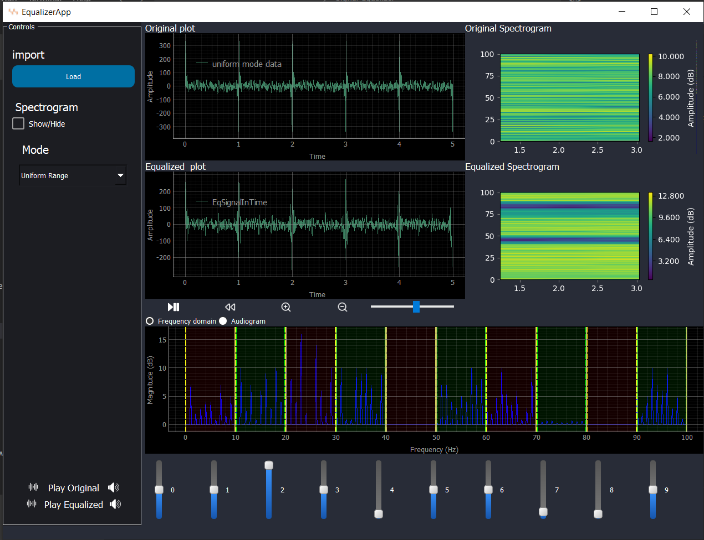
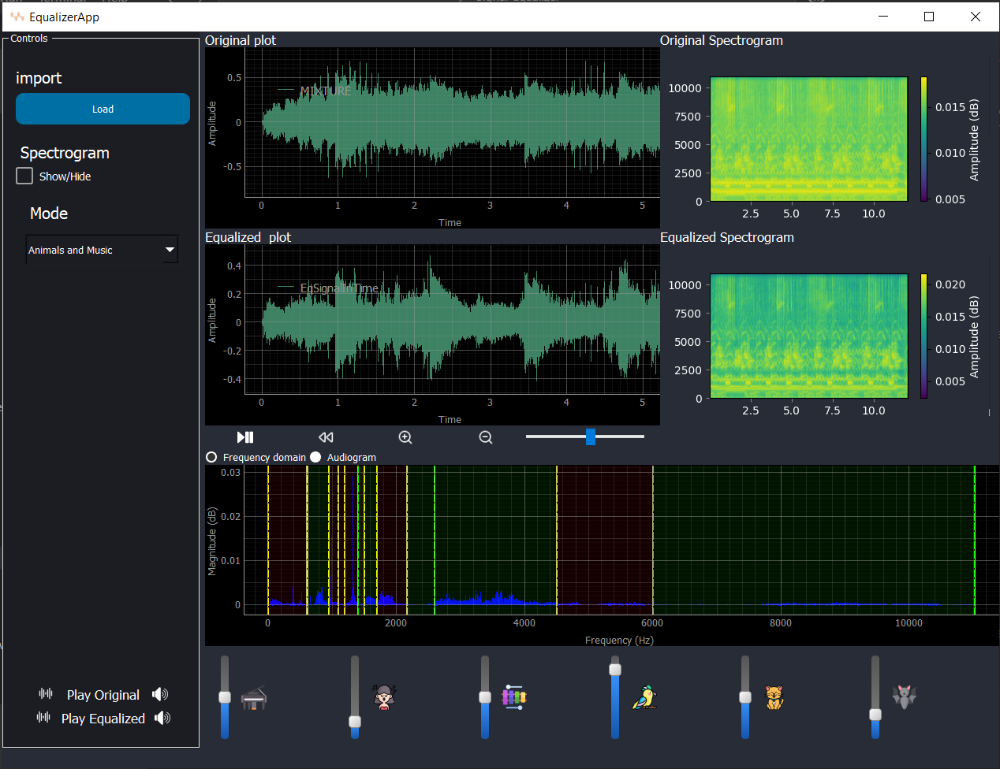
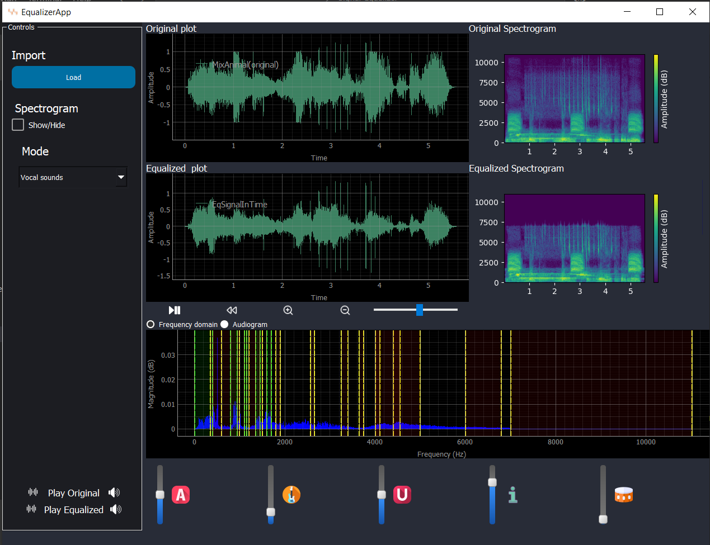
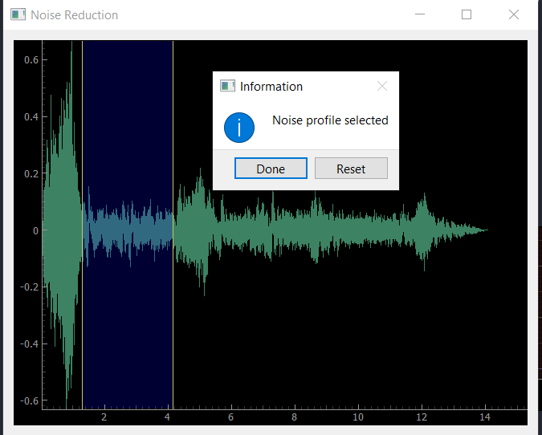
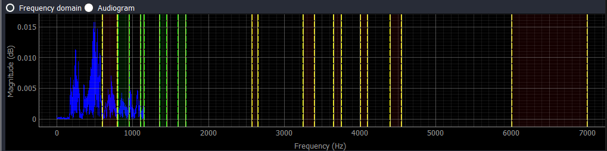
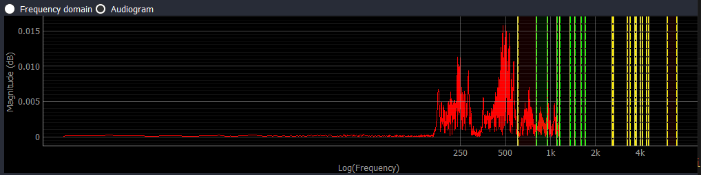

# 🎵 FREQtune: Adaptive Signal Equalizer  

## 📌 Description  
This project involves the development of a **desktop application** for signal processing, allowing users to modify the magnitude of specific frequency components via sliders and reconstruct the signal. The application features multiple operational modes and an intuitive UI for **real-time signal analysis and manipulation**.  

## ✨ Features  

### 1️⃣ **Modes of Operation**  
The application supports multiple modes tailored for different use cases:  

#### 🎚 **Uniform Range Mode**  
- The total frequency range is divided into **10 equal bands**, each controlled by a slider.  
- **Validation:**  
  - A **synthetic signal** composed of pure frequencies helps verify the equalizer’s effect.  

    

#### 🎵 **Music & 🐾 Animal Mode**  
- Sliders control the magnitude of **specific musical instruments and animal sounds** in a mixed audio signal.  
- Supports at least **3 musical instruments** and **3 animal sounds**.  

    

#### 🎤 **Vocal Mode**  
- Enables precise control over **vocals (e.g., vowels) and musical instruments** in a song.  

    

#### 🔊 **Weiner Mode (Noise Reduction)**  
- Implements **Weiner filtering** to remove unwanted noise from the signal.  

    

### 2️⃣ **🖥 Dynamic User Interface**  
- Seamless mode switching via an **option menu or combobox**.  
- UI dynamically updates **slider labels** and **count** based on the selected mode, maintaining a **consistent layout**.  

### 3️⃣ **📈 Fourier Transform Graph**  
- Displays the **Fourier transform** of the signal.  
- Provides two frequency range views:  
  - 📏 **Linear Scale**  
  - 🎧 **Audiogram Scale** (based on audiological standards).  
- **Toggle between scales** without interrupting any functionality.  

    
    

### 4️⃣ **🔗 Linked Signal Viewers**  
- **Two synchronized cine signal viewers** (Input & Output).  
- Features:  
  - ▶️ Play | ⏸ Pause | ⏹ Stop | ⏩ Speed Control  
  - 🔍 Zoom | 🔄 Pan | 🔄 Reset  
- Both viewers stay **perfectly synchronized** during interactions like scrolling or zooming.  

### 5️⃣ **🎨 Spectrograms**  
- Displays **input and output spectrograms**.  
- The output spectrogram **dynamically updates** with equalizer adjustments.  
- Users can **toggle spectrograms ON/OFF** as needed.  

## 🛠 Installation and Usage  

1️⃣ **Clone the repository**:  
   ```bash
   git clone https://github.com/somaiaahmed/Signal-Equalizer.git
   cd Signal-Equalizer
   ```  

2️⃣ **Install dependencies**:  
   ```bash
   pip install -r requirements.txt
   ```  

3️⃣ **Run the application**:  
   ```bash
   python EqualizerApp.py
   ```  

4️⃣ **Use the UI to**:  
   - 🎵 Load an audio signal.  
   - 🎚 Adjust frequency components using sliders.  
   - 🔄 Switch between **modes** and **scales**.  
   - 📊 View and analyze signals with cine viewers and spectrograms.  